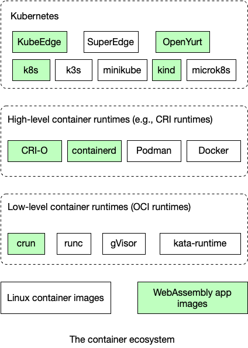

# shcWasmGo
Webassembly PoC with Golang

### 1. pre-requests
- go install : https://go.dev/doc/install
- tinygo : https://tinygo.org/getting-started/install/macos/
``` bash
brew tap tinygo-org/tools
brew install tinygo
```
- (optional) [WebAssembly vscode extension](vscode:extension/dtsvet.vscode-wasm)

### 2. build example
``` bash
tinygo build -o target/hello.wasm -target wasi 
```

### 3-1. run wasm with wasmedge
- [wasmedge install](https://wasmedge.org/book/en/quick_start/install.html)
``` bash
wasmedge target/hello.wasm
```

### 3-2. run in docker with wasmedge
- [docker desktop install](https://docs.docker.com/desktop/install/mac-install/)
- [buildx install](https://docs.docker.com/build/architecture/#buildx) -> 23.0 이상 버전에는 기본 설치
- https://wasmedge.org/book/en/quick_start/use_docker.html

```bash
# username -> docker hub 계정으로 변경
sudo docker buildx build --platform wasi/wasm32  --push --platform=linux/amd64,linux/arm64 -t {username}/hellowasm:1.0 .
sudo docker run --rm --name hello-wasm --runtime=io.containerd.wasmedge.v1 --platform=wasi/wasm32 {username}/hellowasm:1.0

```


### 4. wasmedge + k8s .... TBD..
- kubernetes를 제대로 활용하기 위해서는 low level runtime인 crun의 설정으로 webassembly oci image를 동작시킬수 있게 해야함
- 약간의 성능 저하를 받아들인다면 The slimmed Linux container tailored for WasmEdge를 활용할 수 있다.(기존 docker image와 동일)

